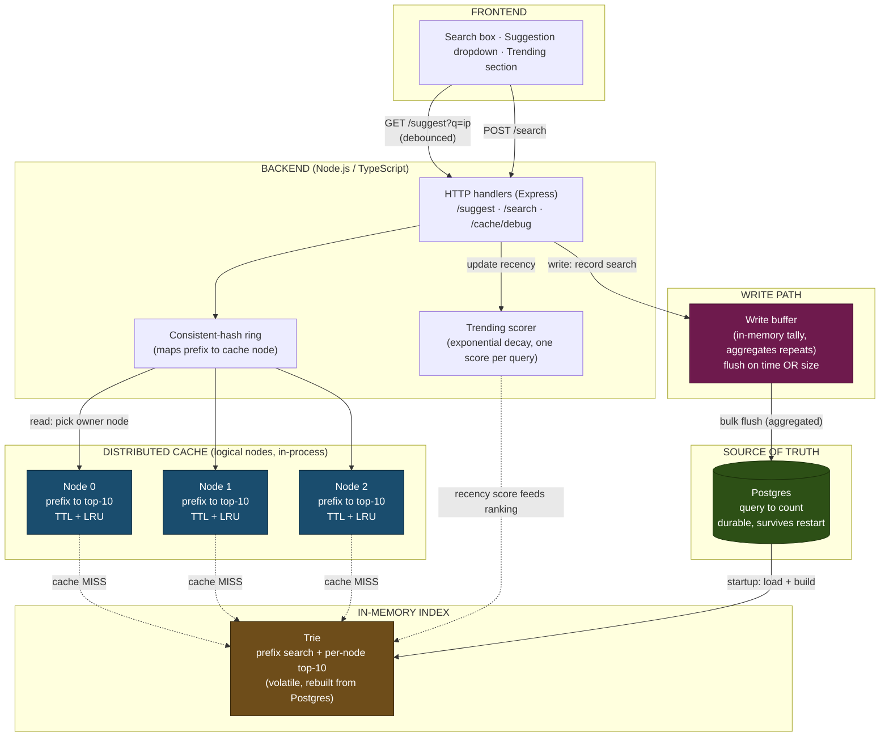

# Type-Ahead System

A search-as-you-type service built with **Node.js and TypeScript**. As you type, it suggests popular queries that start with your prefix, ranked by popularity. Submitting a search records it and updates popularity. Suggestions are served from a distributed in-process cache in front of an in-memory trie, backed by Postgres as the durable source of truth. Recent searches can be boosted via a recency-aware (trending) ranking, and search-count writes are batched to keep write pressure off the database.

The frontend is a single static HTML page served by the same Express server.

---

## Video Walkthrough

[Full walkthrough on Google Drive](https://drive.google.com/drive/folders/16xOTwTpgAdqpRbAP3l0o1zi406pVrqoK?usp=sharing)

---

## What it does

- Prefix suggestions, top 10 by count, case-insensitive, handles empty input
- Search submission with a stub response, recorded into popularity counts
- Distributed cache across logical nodes, routed by consistent hashing
- Trending mode: recency-aware ranking via exponential time decay
- Batched writes: search submissions are aggregated and flushed in bulk
- A live web UI that surfaces cache hit/miss, owning node, and latency per request

---

## Architecture



Four storage layers, each with a distinct job:

- **Postgres** is the durable source of truth (`query, count`). It survives restarts and receives batched writes.
- **Trie** is an in-memory prefix index built from Postgres at startup. It answers prefix queries fast and caches a top-10 list at each node. It is volatile and rebuilt from Postgres on restart.
- **Distributed cache** holds finished suggestion lists for hot prefixes, spread across logical nodes routed by a consistent-hash ring.
- **Write buffer** tallies search submissions in memory and flushes them to Postgres in batches.

The full reasoning is in [DESIGN.md](DESIGN.md). Performance numbers are in [PERFORMANCE.md](PERFORMANCE.md).

The whole design follows from one fact: reads (suggestions, on every keystroke) vastly outnumber writes (submissions). Everything is shaped to make reads nearly free and to defer and batch the write cost.

---

## Setup

Requirements: **Node.js 18+**, **Docker** (for Postgres), and the AOL query dataset.

### 1. Install dependencies

```bash
npm install
```

### 2. Start Postgres

```bash
docker compose up -d
```

Postgres runs on host port **5433** (not the default 5432) to avoid colliding with any local Postgres install. The connection string in the code already uses 5433.

### 3. Get the dataset

This project uses the AOL query log (Kaggle: "AOL User Session Collection").Download it and unzip it [DataSet link](https://www.kaggle.com/datasets/dineshydv/aol-user-session-collection-500k). You will get tab-separated files named `user-ct-test-collection-NN.txt`.

The dataset is **not** committed to this repo: it is large and, given the AOL log's history, not ours to redistribute. Only the query text is used; all user-identifying columns (user ID, timestamps, clicked URLs) are discarded during ingestion.

### 4. Ingest the data

```bash
npm run ingest -- --file=user-ct-test-collection-02.txt
```

This reads the file, normalizes queries (lowercase, trim, drop empty/`-` placeholders), aggregates counts in memory, and bulk-loads `query, count` into Postgres. One file yields ~1.24M unique queries.

### 5. Run the server

```bash
npm run dev
```

It loads Postgres into the trie at startup, then serves on **:8080**.

### 6. Open the UI

Visit **http://localhost:8080/** in a browser. Type a prefix (try `goog`, `map`, `ebay`), use arrow keys to navigate, Enter or the Search button to submit. The panel shows what each request did: latency, cache hit/miss, owning node, and the write-buffer stats.

---

## API

| Method | Path | Purpose | Notes |
|--------|------|---------|-------|
| GET | `/suggest?q=<prefix>` | Top 10 prefix matches by count | Add `&mode=trending` for recency-aware ranking |
| POST | `/search` | Record a search, return stub | Body: `{"query":"..."}`, returns `{"message":"Searched"}` |
| GET | `/cache/debug?prefix=<p>` | Which node owns a prefix, hit/miss | For demonstrating consistent hashing |
| GET | `/cache/stats` | Per-node cache hits/misses/size | |
| GET | `/stats` | Write-buffer stats | searches received, flushes, rows written |

### Examples

```bash
# basic suggestions
curl "http://localhost:8080/suggest?q=goog"

# trending (recency-aware) suggestions
curl "http://localhost:8080/suggest?q=goog&mode=trending"

# submit a search
curl -X POST http://localhost:8080/search \
  -H "Content-Type: application/json" \
  -d '{"query":"iphone"}'

# which node owns this prefix, and is it cached?
curl "http://localhost:8080/cache/debug?prefix=goog"
```

---

## Demonstrations

### Consistent hashing

```bash
npm run ringtest
```

Shows which node owns each of a set of prefixes, then adds a node and reports how many prefixes moved. Only the keys in the new node's arcs move; the rest keep their owner. This is the consistent-hashing property: adding a node remaps about 1/N of keys, not nearly all of them.

### Performance

```bash
./scripts/benchmark.sh
```

Measures p95 latency (cache path vs trie path), cache hit rate, and write reduction through batching. Requires `hey` (`brew install hey`). Results and their interpretation are in PERFORMANCE.md.

### Trending rise-and-fall

In the UI, switch to trending mode and watch a low-ranked query climb after a burst of searches, then fall back as its recency score decays. The decay half-life is 30 seconds by default (configurable in `src/cmd/server.ts`).

---

## Project Layout

```
src/
  cmd/
    server.ts      server entry point: wiring and lifecycle
    ingest.ts      one-time AOL dataset loader
    ringtest.ts    consistent-hashing demonstration utility
  store/
    store.ts       Postgres source of truth (pg pool, upsert, loadAll)
  trie/
    trie.ts        in-memory prefix index with per-node top-K
  cache/
    ring.ts        consistent-hash ring (CRC32-IEEE, virtual nodes, binary search)
    node.ts        cache node (TTL expiration, hit/miss tracking)
    cache.ts       cache coordinator (routes prefixes via ring)
  buffer/
    buffer.ts      write buffer (in-memory aggregation, time/size-based flushing)
  trending/
    trending.ts    recency scorer (exponential decay)
  api/
    handlers.ts    Express route handlers
web/
  index.html       frontend (served as static file)
scripts/
  benchmark.sh     reproducible performance measurement
```

---

## Notes and trade-offs

- The cache nodes are logical (in-process objects), simulating distribution. In production they would be separate processes or Redis instances; the consistent-hash routing is identical either way.
- Batching means a hard crash loses buffered-but-unflushed searches. Acceptable for ranking data; clean shutdown flushes to shrink the window.
- The trie's top-K is computed once at startup. Live count changes go to Postgres via the buffer; the trie can be rebuilt periodically or accept slight staleness, which is fine for ranking.
- See DESIGN.md for the full reasoning behind each choice.
